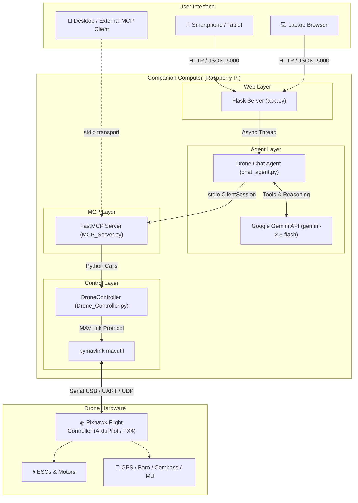

# 🛸 Autonomous Drone Control with Model Context Protocol (MCP) & MAVLink

[](https://www.python.org/)
[](https://mavlink.io/en/)
[](https://modelcontextprotocol.io/)
[](https://aistudio.google.com/)
[](https://ardupilot.org/)
[](https://flask.palletsprojects.com/)

A complete, companion-computer-ready platform enabling **natural language flight control** of Pixhawk-powered autonomous drones. By combining Google's **Gemini API** with the **Model Context Protocol (MCP)** and **pymavlink**, this system translates conversational human commands into precise MAVLink flight instructions in real-time.

---

## 📑 Table of Contents

- [Overview](#-overview)
- [Architecture](#-architecture)
- [Project Structure](#-project-structure)
- [MCP Flight Control Tools](#-mcp-flight-control-tools)
- [Hardware & Companion Computer Setup](#-hardware--companion-computer-setup)
- [Installation & Quickstart](#-installation--quickstart)
- [Dual-Link Setup with MAVProxy (Recommended)](#-dual-link-setup-with-mavproxy-recommended)
- [Running the System](#-running-the-system)
  - [1. Mobile Web Chat UI (End-to-End)](#1-mobile-web-chat-ui-end-to-end)
  - [2. Standalone MCP Server for Desktop & LLM Clients](#2-standalone-mcp-server-for-desktop--llm-clients)
  - [3. Interactive Python Terminal Agent](#3-interactive-python-terminal-agent)
- [Environment Variables](#-environment-variables)
- [Safety & Pre-Flight Protocol](#-safety--pre-flight-protocol)
- [Troubleshooting](#-troubleshooting)

---

## 🔭 Overview

Traditional drone operation requires complex ground control software (like Mission Planner or QGroundControl) or direct RC piloting skills. This project introduces a conversational interface:

- **Conversational Operations**: Issue flight commands like *"Connect to the drone and check GPS fix"*, *"Arm motors and takeoff to 3 meters"*, *"Fly 20 meters north"*, or *"Return to launch and land"*.
- **Model Context Protocol (MCP)**: Standardizes flight controller capabilities into 9 discrete, structured tools that can be consumed by any MCP client (Gemini agent loop, Claude Desktop, custom autonomous agents).
- **Onboard Autonomous Agent**: Runs locally on a companion computer (e.g., Raspberry Pi) mounted directly on the drone frame, executing tool-use loops via the official Google GenAI SDK (`google-genai`).
- **Mobile-Responsive Field UI**: Built-in Flask web interface accessible from any smartphone, tablet, or laptop on the drone's Wi-Fi network.

---

## 🏛️ Architecture

The system is structured in modular layers separating communication protocols, tool definitions, agent orchestration, and presentation:



---

## 📂 Project Structure

```
Drone/
├── README.md                     # Project documentation & reference
└── Innovation/
    ├── Drone_Controller.py       # pymavlink abstraction layer for Pixhawk
    ├── MCP_Server.py             # FastMCP server exposing 9 drone tools via stdio
    ├── chat_agent.py             # Google Gemini tool-use agent loop over MCP client
    ├── app.py                    # Flask web application with responsive chat UI
    └── requirements.txt          # Python dependencies (pymavlink, mcp, google-genai, flask)
```

### Component Details

- **[`Innovation/Drone_Controller.py`](file:///c:/Users/Gaming/Documents/Coding%20Projects/Drone/Innovation/Drone_Controller.py)**:
  Handles direct low-level MAVLink communication via `pymavlink.mavutil`. Manages connection heartbeats, flight mode switching, motor arming/disarming, GUIDED-mode waypoint commands (`MAV_CMD_NAV_WAYPOINT`), takeoff/land commands, and telemetry polling (`GLOBAL_POSITION_INT`, `VFR_HUD`, `HEARTBEAT`).
- **[`Innovation/MCP_Server.py`](file:///c:/Users/Gaming/Documents/Coding%20Projects/Drone/Innovation/MCP_Server.py)**:
  Wraps `DroneController` using the Model Context Protocol (`FastMCP`). Exposes flight capabilities as standardized tools over `stdio` transport. Configurable via environment variables (`DRONE_CONN`, `DRONE_BAUD`).
- **[`Innovation/chat_agent.py`](file:///c:/Users/Gaming/Documents/Coding%20Projects/Drone/Innovation/chat_agent.py)**:
  An asynchronous agent connecting to the local MCP server via `mcp.ClientSession` and coordinating an iterative tool-use loop with Google Gemini (`gemini-2.5-flash`). It automatically converts MCP JSON Schemas into Gemini `FunctionDeclaration` structures and executes tool calls.
- **[`Innovation/app.py`](file:///c:/Users/Gaming/Documents/Coding%20Projects/Drone/Innovation/app.py)**:
  A zero-dependency Flask web application serving a clean chat interface. Spawns an async event loop in a background thread to seamlessly bridge sync HTTP requests with the async MCP agent. Accessible at `http://<pi-ip>:5000`.
- **[`Innovation/requirements.txt`](file:///c:/Users/Gaming/Documents/Coding%20Projects/Drone/Innovation/requirements.txt)**:
  Core Python package requirements: `pymavlink`, `mcp`, `google-genai`, `flask`.

---

## 🛠️ MCP Flight Control Tools

The FastMCP server exposes 9 dedicated tools:

| Tool | Parameters | Description |
| :--- | :--- | :--- |
| `connect_drone` | *None* | Establishes MAVLink connection to the autopilot and waits for the initial heartbeat. Must be run before any other command. |
| `arm_drone` | `force: bool = False` | Arms drone motors. Requires pre-arm checks to pass unless `force=True` (bypasses pre-arm with magic flag `21196`). |
| `disarm_drone` | *None* | Disarms motors immediately. |
| `takeoff` | `altitude_m: float` | Sets flight mode to `GUIDED` and initiates vertical climb to target relative altitude in meters. |
| `goto_location` | `lat: float`, `lon: float`, `alt_m: float` | Commands the drone to fly to the target GPS coordinate and relative altitude in `GUIDED` mode (`MAV_FRAME_GLOBAL_RELATIVE_ALT`). |
| `return_to_launch`| *None* | Switches flight mode to `RTL` (Return to Launch), causing the vehicle to return home and land automatically. |
| `land` | *None* | Switches to `LAND` mode or sends `MAV_CMD_NAV_LAND` to land vertically at current position. |
| `set_flight_mode` | `mode: str` | Sets flight mode directly (e.g., `GUIDED`, `LOITER`, `RTL`, `LAND`, `STABILIZE`, `ALT_HOLD`). |
| `get_telemetry` | *None* | Extracts live telemetry: latitude, longitude, relative altitude (m), groundspeed (m/s), heading (deg), armed status, and active mode. |

---

## 🔌 Hardware & Companion Computer Setup

### Hardware Requirements

1. **Flight Controller**: Pixhawk 2.4.8 / 4 / 6C / 6X, Holybro Pixhawk, or Cube Orange running **ArduPilot (ArduCopter 4.0+)** or **PX4**.
2. **Companion Computer**: Raspberry Pi 4 / 5 (Raspberry Pi OS 64-bit recommended) or NVIDIA Jetson Nano / Orin.
3. **Connection Interface**:
   - **Option 1 (USB)**: Micro-USB / Type-C cable from companion computer USB to Pixhawk USB port (typically exposes `/dev/ttyACM0`).
   - **Option 2 (TELEM UART)**: JST-GH cable from Pixhawk `TELEM2` port to Raspberry Pi GPIO UART pins or a USB-to-UART FTDI adapter (typically `/dev/ttyAMA0` or `/dev/ttyUSB0`).
4. **Power**: 5V 3A+ BEC / step-down regulator powering the Raspberry Pi from the flight battery.

---

## 🚀 Installation & Quickstart

### 1. Clone the Repository

```bash
git clone https://github.com/RehaanJohn/Drones.git
cd Drones
```

### 2. Create and Activate Virtual Environment

```bash
python3 -m venv venv
# On Linux / macOS / Raspberry Pi:
source venv/bin/activate
# On Windows:
venv\Scripts\activate
```

### 3. Install Dependencies

```bash
pip install -r Innovation/requirements.txt
```

### 4. Configure Environment Variables

Set your Google Gemini API key (from [Google AI Studio](https://aistudio.google.com/)) and connection parameters:

```bash
# Linux / Raspberry Pi:
export GEMINI_API_KEY="your-gemini-api-key-here"
export GEMINI_MODEL="gemini-2.5-flash"   # Or gemini-2.0-flash
export DRONE_CONN="/dev/ttyACM0"        # Or MAVProxy UDP stream: udp:127.0.0.1:14550
export DRONE_BAUD="115200"              # Or 57600 for TELEM ports

# Windows PowerShell:
$env:GEMINI_API_KEY="your-gemini-api-key-here"
$env:GEMINI_MODEL="gemini-2.5-flash"
$env:DRONE_CONN="COM3"
$env:DRONE_BAUD="115200"
```

---

## 📡 Dual-Link Setup with MAVProxy (Recommended)

When testing in the field, it is crucial to keep **Mission Planner** or **QGroundControl** connected alongside the MCP Agent. A serial port cannot be opened by two processes simultaneously; use `MAVProxy` to route the MAVLink stream over UDP:

```bash
# Install MAVProxy
pip install mavproxy

# Option A: Forward telemetry locally for the MCP agent only
mavproxy.py --master=/dev/ttyACM0 --baudrate=115200 --out=udp:127.0.0.1:14550

# Option B: Forward to both local MCP agent AND a laptop running Mission Planner / QGC
# (Replace 192.168.1.50 with your laptop's actual IP on the local network)
mavproxy.py \
  --master=/dev/ttyACM0 \
  --baudrate=115200 \
  --out=udp:127.0.0.1:14550 \
  --out=udp:192.168.1.5:14550
```

Then configure the MCP Agent to connect via local UDP:
```bash
export DRONE_CONN="udp:127.0.0.1:14550"
```

---

## 🎮 Running the System

### 1. Mobile Web Chat UI (End-to-End)

Run the Flask server onboard the companion computer:

```bash
cd Innovation
python app.py
```

Then open your mobile browser or laptop browser and navigate to:
```
http://<raspberry-pi-ip>:5000
```

#### Example Conversation

```text
User: Connect to the drone and check status.
Assistant: Connected to Pixhawk (System ID: 1, Component ID: 1).
           Telemetry Status:
           - Mode: STABILIZE
           - Armed: False
           - Altitude: 0.0 m
           - GPS: 37.7749° N, -122.4194° W
           - Heading: 184°

User: Arm and takeoff to 3 meters.
Assistant: Switched flight mode to GUIDED and armed motors. 
           Takeoff command sent for target altitude of 3.0 meters.

User: What is our current altitude?
Assistant: Current relative altitude is 3.1 meters, hovering in GUIDED mode.

User: Return to launch.
Assistant: RTL mode triggered. The vehicle is returning to home position and descending for landing.
```

---

### 2. Standalone MCP Server for Desktop & LLM Clients

You can expose the drone tools directly to any MCP client (such as Claude Desktop, Gemini CLI, or custom clients) using standard `stdio` transport. Add the server configuration to your MCP client config:

```json
{
  "mcpServers": {
    "drone-control": {
      "command": "python3",
      "args": [
        "/path/to/Drones/Innovation/MCP_Server.py"
      ],
      "env": {
        "DRONE_CONN": "/dev/ttyACM0",
        "DRONE_BAUD": "115200"
      }
    }
  }
}
```

---

### 3. Interactive Python Terminal Agent

You can also run the agent directly within Python or embed it in custom autonomous routines:

```python
import asyncio
from Innovation.chat_agent import DroneChatAgent

async def main():
    agent = DroneChatAgent()
    await agent.connect()
    
    # Send natural language prompt
    response = await agent.chat("Connect to the vehicle and report GPS coordinates")
    print(response)
    
    await agent.close()

if __name__ == "__main__":
    asyncio.run(main())
```

---

## ⚙️ Environment Variables

| Variable | Default Value | Description |
| :--- | :--- | :--- |
| `GEMINI_API_KEY` | *Required* | Google Gemini API key (from https://aistudio.google.com) |
| `GEMINI_MODEL` | `gemini-2.5-flash` | Gemini model string (e.g. `gemini-2.5-flash`, `gemini-2.0-flash`) |
| `DRONE_CONN` | `/dev/ttyACM0` | MAVLink connection string (`/dev/ttyACM0`, `/dev/ttyAMA0`, `udp:127.0.0.1:14550`, or Windows `COM3`) |
| `DRONE_BAUD` | `115200` | Serial baud rate (standard USB: `115200`, TELEM ports: `57600` or `115200`) |

---

## ⚠️ Safety & Pre-Flight Protocol

> [!CAUTION]
> **PROPELLERS OFF DURING BENCH TESTING!**  
> Always remove all propellers before connecting software or issuing arm/takeoff commands on a test bench.

1. **Manual RC Override**: Always keep your physical RC transmitter powered on and in hand. Configure a physical flight mode switch to switch instantly to `STABILIZE` or `ALT_HOLD` to override automated commands in an emergency.
2. **Pre-Arm Checks**: Do not use `force=True` on real flights. Ensure the GPS has acquired a stable 3D fix and HDOP is below 1.5 before arming.
3. **Geofencing**: Configure hardware geofencing in ArduPilot/PX4 parameters (`FENCE_ENABLE`, `FENCE_ALT_MAX`, `FENCE_RADIUS`) as a hard safety boundary independent of LLM decisions.
4. **Failsafe Setup**: Verify that battery failsafe, RC loss failsafe, and GCS connection loss failsafe are configured to trigger `RTL` or `LAND`.

---

## 🔧 Troubleshooting

### 1. Serial Port Permission Denied on Linux / Raspberry Pi
```bash
sudo usermod -a -G dialout $USER
# Log out and log back in for changes to take effect
```

### 2. Autopilot Heartbeat Timeout
- Confirm the serial device is correct: `ls /dev/ttyACM*` or `ls /dev/ttyUSB*`.
- Check baud rate matching: Pixhawk USB default is `115200`; TELEM2 default is often `57600` or `115200`. Check `SERIAL2_BAUD` parameter in ArduPilot.

### 3. Drone Refuses to Arm (`no_ack` or `failed`)
- Check telemetry: verify GPS 3D fix and sensor calibration.
- In ArduPilot, review pre-arm error messages via Mission Planner or MAVProxy.

---

## 📄 License

This project is licensed under the MIT License. See [LICENSE](LICENSE) for details.
