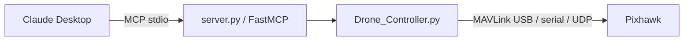

# Pixhawk control through FastMCP

Claude Desktop calls the drone tools directly over MCP stdio. Claude handles
conversation and tool selection; this repository needs no LLM API key or Flask
chat server.


```mermaid
flowchart LR
    Claude[Claude Desktop] -->|MCP stdio| Server[server.py / FastMCP]
    Server --> Controller[Drone_Controller.py]
    Controller -->|MAVLink USB / serial / UDP| Pixhawk
```

## Code layout

- `server.py`: FastMCP entry point, nine typed tools, serialized MAVLink access,
  and connection cleanup when the server exits. Hardware connects only when
  `connect_drone` is called.
- `Drone_Controller.py`: existing pymavlink connection, flight commands, ACK
  handling, and telemetry polling.
- `MCP_Server.py`: compatibility launcher for existing MCP configurations.
- `requirements.txt`: FastMCP and pymavlink dependencies.
- `../QR_Scanning/`: independent terminal camera/QR scanner that writes scans
  to a file. It is not exposed as MCP tools.

The former `app.py` Flask chat UI and `chat_agent.py` Groq/Gemini loop have been
removed. QR scanning now runs separately in the terminal; see
[QR scanner instructions](../QR_Scanning/README.md).

## Install

Use Python 3.10 or later on the computer running Claude Desktop:

```bash
cd /path/to/Drones
python3 -m venv .venv
.venv/bin/python -m pip install -r Innovation/requirements.txt
```

On Windows, use `.venv\Scripts\python.exe` instead of `.venv/bin/python`.

## Connect Claude Desktop

Edit the Claude Desktop configuration:

- macOS: `~/Library/Application Support/Claude/claude_desktop_config.json`
- Windows: `%APPDATA%\Claude\claude_desktop_config.json`

Merge this entry into any existing `mcpServers` object. The example below uses
the current macOS checkout paths. A ready-to-merge copy is available in
[`claude_desktop_config.macos.json`](claude_desktop_config.macos.json).
It listens for MAVLink forwarded over UDP port 14550; change `DRONE_CONN` to
your actual `/dev/cu.*` port for direct USB:

```json
{
  "mcpServers": {
    "pixhawk": {
      "command": "/Users/rehaanjohn/edop/Coding Projects/Drones/Drones/.venv/bin/python",
      "args": ["/Users/rehaanjohn/edop/Coding Projects/Drones/Drones/Innovation/server.py"],
      "env": {
        "DRONE_CONN": "udpin:0.0.0.0:14550",
        "DRONE_BAUD": "115200"
      }
    }
  }
}
```

On Windows use the absolute path to `.venv\Scripts\python.exe` and escape
backslashes in JSON (for example `C:\\Drones\\Innovation\\server.py`).
Restart Claude Desktop after saving. Claude launches the server itself; no
separate web server or terminal process is required. Start by asking:
“Connect to the drone and report telemetry.”

FastMCP's [stdio documentation](https://gofastmcp.com/deployment/running-server)
describes how the desktop client launches and manages the process.

## Hardware connection

The serial device must be accessible to the computer launching `server.py`.
`/dev/ttyACM0` is a typical Linux device, not a macOS device. For direct USB on
macOS, find the actual device using `ls /dev/cu.usb*`; on Windows use a port such
as `COM3`. Set `DRONE_CONN` accordingly. `DRONE_BAUD` defaults to `115200`.

### Raspberry Pi USB with Claude on your Mac (SSH / Tailscale)

For this setup the MCP server runs on the Pi, where Pixhawk is attached by USB.
Claude Desktop on your Mac launches `/usr/bin/ssh`, which carries MCP stdio.
VNC can be used to manage the Pi, but does not carry the MCP connection.

On the Pi, clone this branch and install its dependencies:

```bash
git clone --branch feat/direct-claude-fastmcp https://github.com/RehaanJohn/Drones.git
cd Drones
python3 -m venv .venv
.venv/bin/python -m pip install -r Innovation/requirements.txt
```

Set up SSH key authentication and verify the host key by connecting manually
from your Mac first. Use the Pi's LAN address or Tailscale hostname. Merge the
following into your Mac's Claude configuration, replacing the user, hostname,
and both Pi paths with your actual values:

```json
{
  "mcpServers": {
    "pixhawk": {
      "command": "/usr/bin/ssh",
      "args": [
        "-T",
        "-o",
        "BatchMode=yes",
        "<pi-user>@<pi-tailscale-hostname>",
        "/home/<pi-user>/Drones/.venv/bin/python /home/<pi-user>/Drones/Innovation/server.py"
      ]
    }
  }
}
```

A copy is provided in
[`claude_desktop_config.rpi-ssh.json`](claude_desktop_config.rpi-ssh.json).
Use this entry instead of the local macOS entry for the same `pixhawk` server.
`-T` disables terminal allocation; `BatchMode=yes` prevents password prompts
from blocking Claude. The Pi server defaults to `/dev/ttyACM0` at `115200` baud.
For another port, prefix the remote command with, for example,
`env DRONE_CONN=/dev/ttyUSB0 DRONE_BAUD=57600`. Keep remote shell startup output
on stderr so stdout remains available for MCP messages.

### Alternative: run the server on your Mac using MAVLink UDP

If you prefer the local macOS configuration above, forward MAVLink from the Pi
with MAVProxy installed:

```bash
mavproxy.py --master=/dev/ttyACM0 --baudrate=115200 --out=udp:<mac-ip-or-tailscale-ip>:14550
```

The local configuration listens on `udpin:0.0.0.0:14550`. Allow inbound UDP port
14550 on the Mac. Only one process should open the physical serial port. Do not
run the SSH server and MAVProxy against the same USB port at the same time.

## Tools

| Tool | Parameters | Behavior |
| --- | --- | --- |
| `connect_drone` | none | Open MAVLink and wait for a heartbeat |
| `arm_drone` | `force: bool = false` | Arm and return command ACK status |
| `disarm_drone` | none | Disarm and return command ACK status |
| `takeoff` | `altitude_m: float` | Request GUIDED mode and takeoff |
| `goto_location` | `lat`, `lon`, `alt_m`: float | Send a guided waypoint at relative altitude |
| `return_to_launch` | none | Request RTL mode |
| `land` | none | Send a landing command |
| `set_flight_mode` | `mode: str` | Request a supported flight mode |
| `get_telemetry` | none | Read position, altitude, speed, heading, armed state, and mode |

The controller's flight behavior is retained. `mode_set_requested` and
`waypoint_sent` indicate a request was sent; they do not prove completion.
`ok` means an ACK reported acceptance; `failed` and `no_ack` must not be treated
as success. Check telemetry to assess the vehicle's state.

## Validation

The tests use a fake controller for tool forwarding and a real stdio subprocess
for MCP discovery and error handling. They do not connect to hardware:

```bash
.venv/bin/python -m unittest discover -s Innovation/tests -v
```

## Existing flight limitations

This is a proof of concept. The controller has no software geofence or
altitude/distance limits, and the server instructions to request confirmation
are not an enforced tool authorization mechanism. Remove propellers for bench
testing, retain manual RC control, and configure autopilot geofencing and
failsafes before flight. Avoid `force=true` during real flights.

If connection fails, check the serial path, baud rate, device permissions, and
whether another program owns the port. On Linux, serial access may require
membership in the `dialout` group. Claude's MCP logs can help diagnose launch
errors; use the virtual environment interpreter with the installed dependencies.
